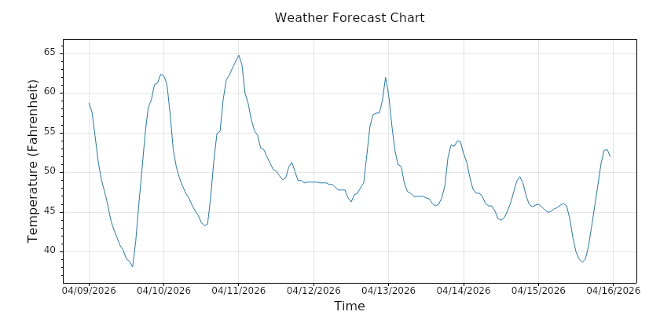
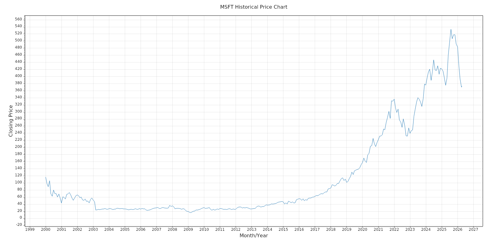

# Overview

Available job module definitions are listed below.

## Weather Report
Generate a weather report (within the next 1, 3 or 7 days) based on input location and date, and send an email to target recipient. Weather data is fetched from the free version of [Open-Meteo](https://open-meteo.com/).

Refer to [Weather Report Data Schema](api-contract.md#weatherreport-jobmoduleid-1) for more details.

Sample chart generated.

## Stock Price Report
Generate a full monthly historical price report of a stock symbol and send an email to target recipient. Stock price data is fetched from the free version of [Alpha Vantage](https://www.alphavantage.co/).

Refer to [Stock Price Report Data Schema](api-contract.md#stockpricereport-jobmoduleid-2) for more details.

Sample chart generated.

# Adding Job Module

Adding new job module requires

- Implementing [IJobModuleHandler](../Worker/Interfaces/IJobModuleHandler.cs)
- Adding a new entry to `JobModule` table via [DispatchDbContext](../Data/DispatchDbContext.cs)
- Exposing this new job module by adding a new request contract that describe its input (i.e. [WeatherReportInput](../Contracts/JobModules/WeatherReportInput.cs)) and a corresponding validator code in [Api/Services/JobService](../Api/Services/JobService.cs)
