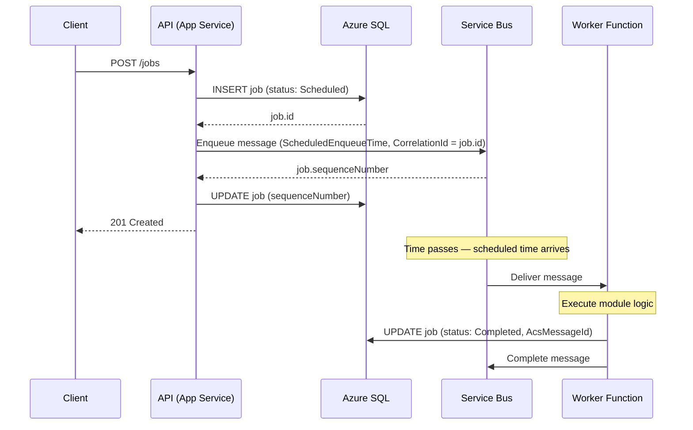
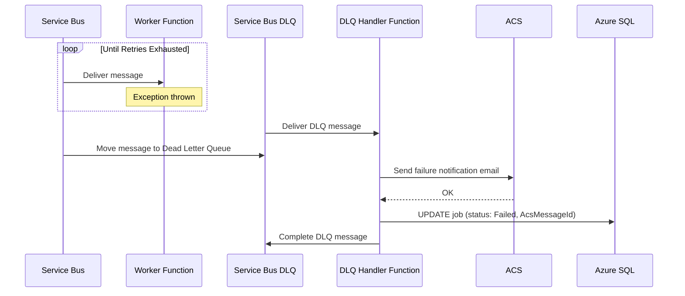
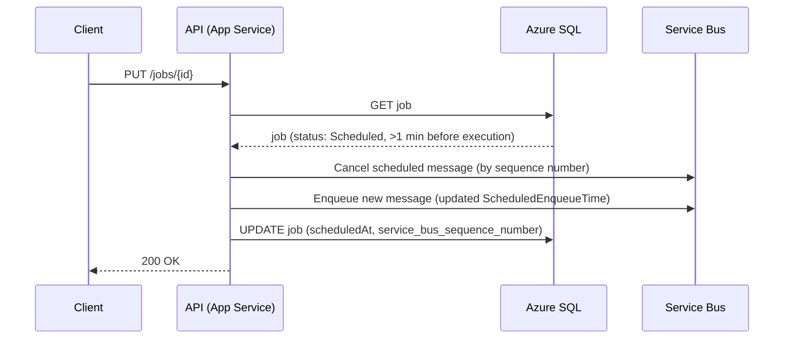
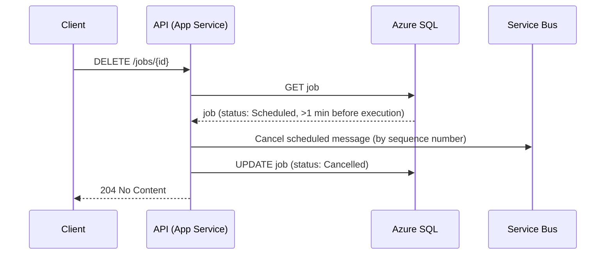
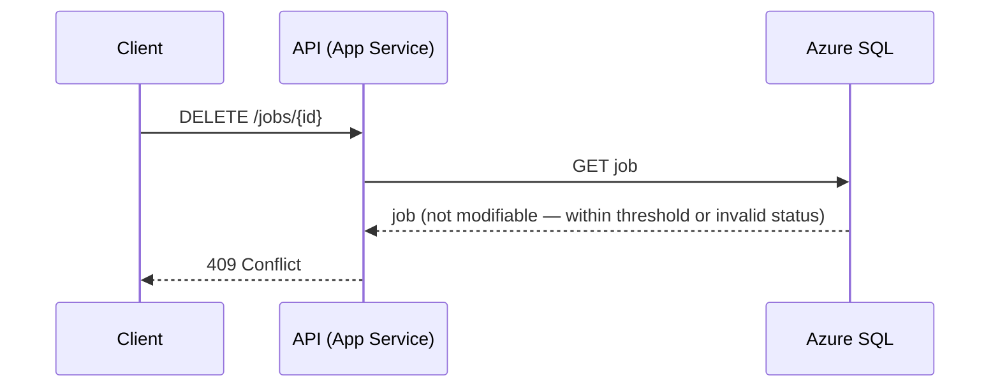

# 1. Job Scheduled and Executed

# 2. Failure Path — Worker Fails, DLQ Handler Fires

# 3. Job Modification Before Threshold

# 4. Job Cancellation Before Threshold

# 5. Job Modification After Threshold

# 6. Job Cancellation After Threshold

