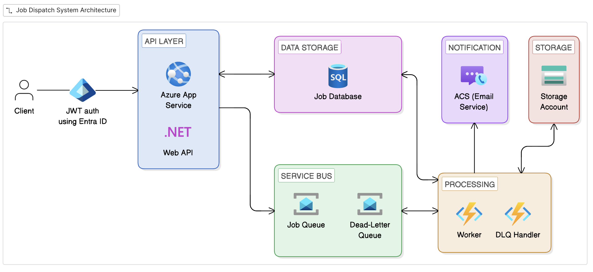

# Dispatch

A job scheduling service built on Azure that allows authorized clients to schedule predefined (extendable) jobs with custom input via a REST API. At the scheduled time, the backend executes the job and sends an email notification with the results.

## Architecture

## How It Works

**Happy path:** Client schedules a job via the API. The API persists the job to Azure SQL and enqueues a Service Bus message with a scheduled delivery time. When the time arrives, the Worker Function picks up the message, executes the job module logic, emails the results via ACS, and marks the job as completed.

**Failure path:** If the Worker throws, Service Bus retries per its retry policy. After max delivery attempts, the message lands in the Dead Letter Queue. A DLQ Handler Function marks the job as failed and sends a failure notification email.

## Tech Stack

- **API** — ASP.NET Core Web API on Azure App Service
- **Worker** — Azure Functions (Service Bus trigger, Flex Consumption plan)
- **Messaging** — Azure Service Bus (scheduled messages, DLQ)
- **Database** — Azure SQL (EF Core, code-first migrations)
- **Email** — Azure Communication Services
- **Auth** — Entra ID (client credentials flow, JWT bearer)
- **Identity** — Managed Identity throughout (zero stored secrets for Azure-to-Azure auth)
- **Observability** — Application Insights + Log Analytics

## Auth and Identity

External clients authenticate via **Entra ID client credentials flow**. The API validates the JWT and uses the `appid` claim to scope data access. Clients can only view or modify jobs they created.

All Azure-to-Azure communication uses **Managed Identity** (no connection strings with secrets):

| Boundary | Identity | Role |
|----------|----------|------|
| App Service &rarr; Service Bus | System-assigned MI | Azure Service Bus Data Sender |
| App Service &rarr; Azure SQL | System-assigned MI | db_datareader, db_datawriter |
| Worker Function &rarr; Service Bus | User-assigned MI | Azure Service Bus Data Receiver |
| Worker Function &rarr; Azure SQL | User-assigned MI | db_datareader, db_datawriter |
| Worker Function &rarr; ACS | User-assigned MI | Communication and Email Service Owner |

## Job Modules

Dispatch supports pluggable job modules. Each module defines its own input schema and execution logic. 

Additional job modules can be added by implementing [IJobModuleHandler](Worker/Interfaces/IJobModuleHandler.cs). See [Docs/job-module](Docs/job-module.md) for more details.

| Module | Description |
|--------|-------------|
| **Weather Report** | Fetches forecast data from [Open-Meteo](https://open-meteo.com/) and emails a weather report |
| **Stock Price Report** | Fetches monthly historical prices from [Alpha Vantage](https://www.alphavantage.co/) and emails a stock price report |

## Solution Structure

| Project | Type | Responsibility |
|---------|------|----------------|
| `Api/` | ASP.NET Core Web API | Accept and validate job requests, enqueue to Service Bus |
| `Worker/` | Azure Functions (Service Bus trigger) | Execute job module logic, send notifications |
| `Data/` | Class library | EF Core DbContext, entities, migrations |
| `Contracts/` | Class library | Shared job module input models |
| `Api.Tests/` | xUnit test project | Unit tests for API controllers and services using xUnit, Moq, and EF Core InMemory |
| `Worker.Tests/` | xUnit test project | Unit tests for Worker functions, handlers, and API services using xUnit, Moq, and EF Core InMemory |

## API

Full CRUD operations on jobs — `POST`, `GET`, `PUT`, `PATCH`, `DELETE` — scoped to the calling client. `PUT` performs a full replacement; `PATCH` allows partial updates (e.g., reschedule without resending the data payload). Errors follow the [RFC 7807](https://datatracker.ietf.org/doc/html/rfc7807) Problem Details format.

See [API Contract](Docs/api-contract.md) for endpoint details, request/response schemas, and sample payloads.

## Documentation

Detailed design docs live in [`Docs/`](Docs/):

- [Architecture Overview](Docs/architecture-overview.md)
- [Data Model](Docs/data-model.md)
- [API Contract](Docs/api-contract.md)
- [Job Modules](Docs/job-module.md)
- [Infrastructure](Docs/infrastructure.md)
- [Sequence Diagrams](Docs/sequence-diagrams.md)
- [Architecture Decision Records](Docs/adr/)

## CI/CD

GitHub Actions with two workflows:

- **CI** ([ci.yml](.github/workflows/ci.yml)) — build and test on every push to `main` or `release`
- **Deploy** ([deploy.yml](.github/workflows/deploy.yml)) — publish and deploy to Azure after CI succeeds on `release`, or via manual trigger. Authenticates via OIDC federated credential (GitHub → Entra ID).

The `release` branch is protected — changes require a PR with owner approval and passing CI checks.

## Roadmap

- Terraform IaC
- Azure Aspire for local dev orchestration
